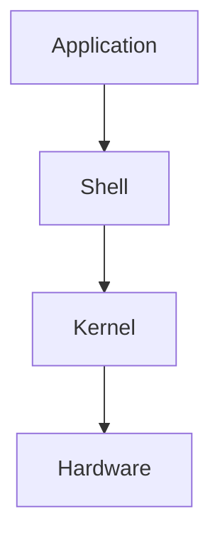
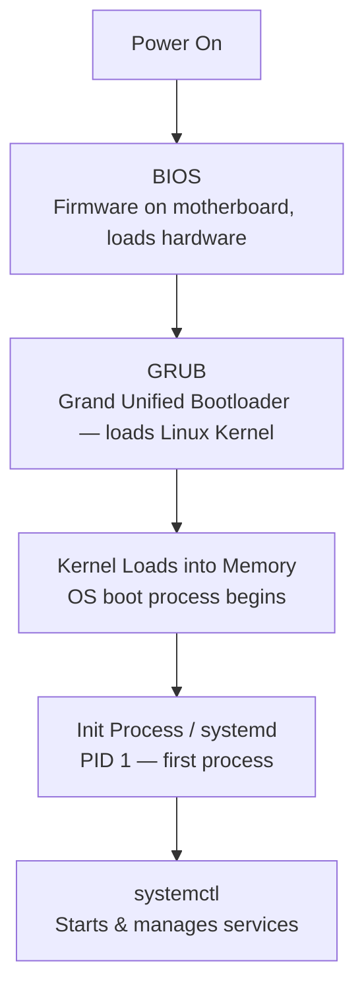
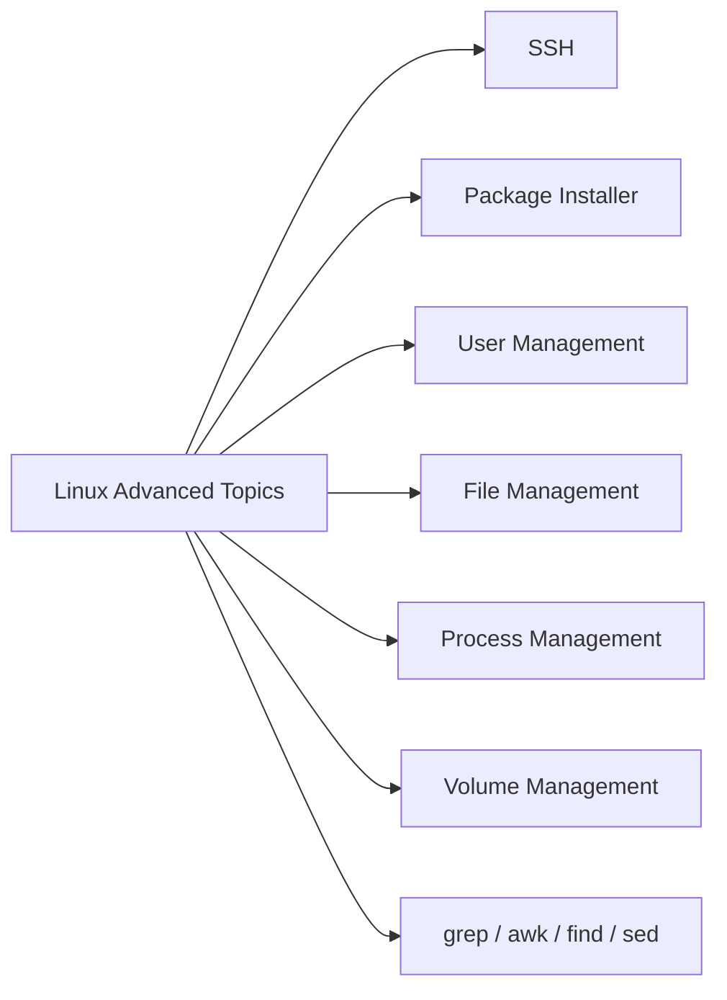
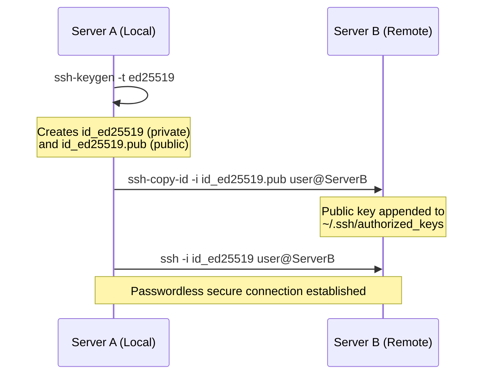
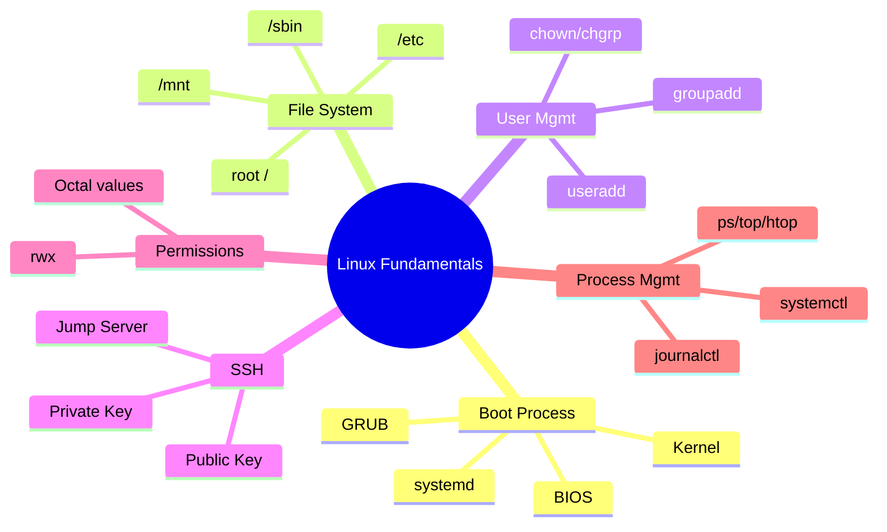

# 🐧 Linux Fundamentals — Complete Study Guide

> Created by **Linus Torvalds** on **September 17, 1991**

---

## 1. Core Philosophy

> **"Everything in Linux is either a file or a directory."**
> **"Everything starts with a process."**

All of Linux is organized under a single root directory: `/`

---

## 2. The ASK Principle

A simple way to remember how Linux is layered, from what you type to what actually runs it:



| Layer | Role |
|---|---|
| **A**pplication | Programs the user interacts with |
| **S**hell | Interprets commands, talks to the kernel |
| **K**ernel | Core of the OS — manages memory, processes, devices |
| **H**ardware | Physical machine resources |

---

## 3. Popular Linux Distributions

- Ubuntu
- CentOS
- Fedora
- RHEL (Red Hat Enterprise Linux)
- Kali Linux

---

## 4. Linux Boot Architecture

What actually happens between pressing the power button and getting a working terminal:



**Key process commands:**

| Command | Purpose |
|---|---|
| `ps` | Show processes |
| `ps -a` | Show active processes |
| `ps aux \| grep <name>` | Search for a specific process |
| `top` | Live view of all processes |
| `htop` | Interactive, real-time process viewer (scrollable) |
| `kill <pid>` | Kill process by ID |
| `kill -9 <pid>` | Send SIGKILL — force kill |
| `nohup <cmd> &` | Run in background, survives terminal close |
| `&` | Run a command in the background |

---

## 5. Essential Navigation Commands

| Command | What it does |
|---|---|
| `uname -r` | Show exact kernel version |
| `pwd` | Print working directory |
| `ls` | List files |
| `cd /` | Go to root |
| `cd ~` or `cd` | Go to home directory |
| `cd /usr/bin` | View user-level binaries/commands |
| `cd /sbin` | System binaries — admin-only (e.g. reboot) |
| `man <command>` | Manual/help for a command |
| `cp source destination` | Copy files |
| `hostname` / `ip addr` / `ip -d addr` | Find IP address |
| `ifconfig` | Configure network interface |
| `free -h` | Memory usage (human-readable) |
| `df -h` | Disk usage (human-readable) |
| `wc -l file` | Count lines in a file |
| `lsblk` | List block devices (e.g. new EC2 disks) |
| `usermod -aG group user` | Add existing user to a group |

---

## 6. Key File System Concepts

| Path / Concept | Meaning |
|---|---|
| `/mnt` | Temporary mount point for external storage/filesystems |
| `/sbin` | System-admin-only binaries (not for regular users) |
| `/etc/fstab` | File System Table — config for **permanent** auto-mounting on reboot |
| `/etc/shadow` | Stores **encrypted/hashed** user passwords |
| `/etc/passwd` | Stores general user account info |
| `systemd` (PID 1) | First process started by the kernel |

💡 **Memory tip:** Anything you want to persist across a reboot (mounts, volumes) → look in `/etc`.

**Permission troubleshooting:**
- User can't write to a file, but permissions "look fine"? → Check **ownership**, not just permission bits.
- `chgrp` changes the **group** of a file (not the owner).
- `chown` changes the **owner**.

**Piping & package management:**
- `|` — pipes output of one command as input to another
- `apt` — Ubuntu's package manager

---

## 7. Linux Advanced Concepts (Roadmap)



---

## 8. SSH — Secure Shell

SSH uses **asymmetric cryptography** — two mathematically linked keys — to log in securely without a password.

| Key | Location | Analogy |
|---|---|---|
| **Public Key** | Shared with the remote server | A padlock |
| **Private Key** | Stays on your local machine | The key that opens the padlock |

### Connecting Server A → Server B



**Step-by-step:**

1. **Generate key pair on Server A**
   ```
   ssh-keygen -t ed25519 -C "serverA_connection"
   ```
2. **Copy public key to Server B**
   ```
   ssh-copy-id -i ~/.ssh/id_ed25519.pub user@server_b_ip
   ```
3. **Connect without a password**
   ```
   ssh -i ~/.ssh/id_ed25519 user@server_b_ip
   ```

**Good to know:**
- SSH config lives at `/etc/ssh/sshd_config`
- A **Bastion / Jump Server** is a middle server DevOps engineers SSH through to reach production servers securely.

---

## 9. Package Managers by Distro

| OS | Package Manager |
|---|---|
| Ubuntu | `apt` |
| RedHat | `rpm`, `dnf` |
| CentOS | `yum` |
| macOS | `brew` |

**Logs & services:**
- `systemctl` — start/stop/check services
- `journalctl -u <service>` — view logs for a service (e.g. `journalctl -u nginx`)

---

## 10. User Management

| Command | Purpose |
|---|---|
| `sudo` | Run as root/admin |
| `sudo su` | Switch user |
| `useradd` | Create a new user |
| `sudo useradd -m sachin` | Create user **with** home directory |
| `sudo useradd -m madhuri -s /usr/bin/bash` | Create user with Bash shell |
| `userdel` | Delete a user |
| `sudo rm -rf /home/username` | Permanently delete user's home directory |
| `passwd` | Change password |
| `sudo passwd user` | Change a specific user's password |
| `su username` | Switch into another user's session |
| `which bash` | Check current shell path |

### Group Management

| Command | Purpose |
|---|---|
| `groupadd <name>` | Create a new group |
| `cat /etc/group` | View group info |
| `getent passwd` | List users |
| `getent group` | List groups |
| `usermod` | Modify a user |
| `sudo gpasswd -a <user> <group>` | Add user to a group |

**`gpasswd` key options:**

| Flag | Meaning |
|---|---|
| `-a` | Add user to group |
| `-d` | Remove user from group |
| `-r` | Remove group's password |
| `-M` | Set full member list |
| `-A` | Set group administrators |

💡 Groups let you **restrict access** — e.g., a file owned by the `ubuntu` group stays inaccessible to other groups.

### Ownership

| Command | Purpose |
|---|---|
| `sudo chown newuser filename` | Change file **owner** |
| `sudo chgrp sachin newfile.txt` | Change file **group** |

---

## 11. File Permissions

Every file/directory has 10 characters describing its type and permissions:

```
drwxr-xr-x  3 root root 4096 Sep 10 19:31 batch10   ← 'd' = directory
-rw-r--r--  1 ubuntu root  45 Sep 10 19:39 file.txt  ← '-' = regular file
```

Structure: `[type][owner][group][others]`

The three permission categories:
- **R**ead — via `cat`
- **W**rite — via `vim`, `nano`
- **E**xecute — run as script/binary via `./filename`

### Permission Truth Table (Octal Values)

| Value | Read | Write | Execute | Meaning |
|:---:|:---:|:---:|:---:|---|
| 0 | ✗ | ✗ | ✗ | No permissions |
| 1 | ✗ | ✗ | ✓ | Execute only |
| 2 | ✗ | ✓ | ✗ | Write only |
| 3 | ✗ | ✓ | ✓ | Write + Execute |
| 4 | ✓ | ✗ | ✗ | Read only |
| 5 | ✓ | ✗ | ✓ | Read + Execute |
| 6 | ✓ | ✓ | ✗ | Read + Write |
| 7 | ✓ | ✓ | ✓ | Full permissions |

Example: `chmod 755 script.sh` → Owner: **7** (rwx), Group: **5** (r-x), Others: **5** (r-x)

---

## Quick Recap Cheat Sheet



---

*Prepared as part of DevOps Batch-10 Linux Fundamentals study series.*
